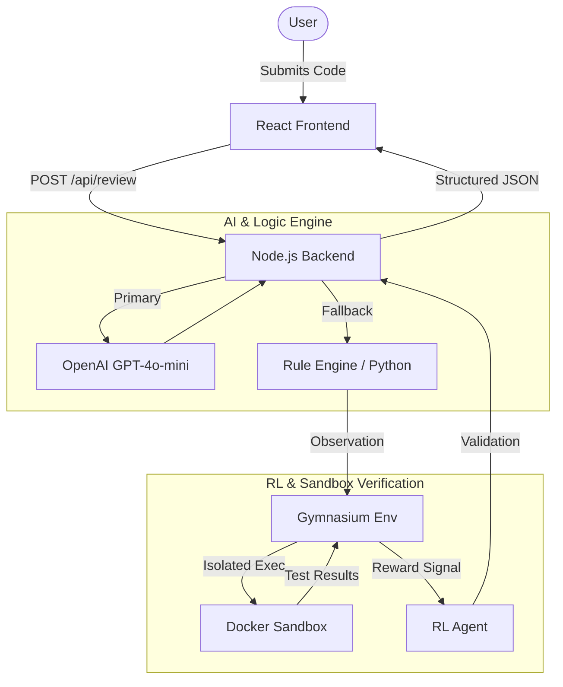

# 🔍 CodeReview AI — Full-Stack Prototype

An interactive AI-powered code review platform. Submit code and get instant
bug detection, logic analysis, optimization suggestions, and a final verdict.

---

## 📁 Folder Structure

```
code-review-app/
├── backend/
│   ├── server.js          ← Express API server
│   ├── reviewEngine.js    ← Rule-based fallback reviewer (no API key needed)
│   ├── package.json
│   └── .env.example       ← Copy to .env and add your API key
│
├── frontend/
│   ├── public/
│   │   └── index.html
│   ├── src/
│   │   ├── App.jsx              ← Root component + API call
│   │   ├── index.js
│   │   ├── constants.js         ← Sample code, language config, helpers
│   │   └── components/
│   │       ├── CodeEditor.jsx   ← Line-numbered editor with bug highlights
│   │       ├── BugCard.jsx      ← Expandable bug card
│   │       └── ScoreRing.jsx    ← Animated SVG score ring
│   └── package.json
│
└── README.md
```

---

## 🚀 Quick Start

### 1. Clone / unzip the project

```bash
cd code-review-app
```

### 2. Set up the backend

```bash
cd backend
npm install

# Copy the env template and add your OpenAI API key
cp .env.example .env
# Edit .env → set OPENAI_API_KEY=sk-proj-...

npm run dev      # starts on http://localhost:4000
```

> **No API key?** The app still works — it uses the built-in rule-based
> engine automatically. You'll see a yellow "Rule-based engine" badge.

### 3. Set up the frontend

```bash
# In a new terminal:
cd frontend
npm install
npm start        # starts on http://localhost:3000
```

Open **http://localhost:3000** in your browser.

---

## 🧠 Technical Architecture



---

## 🏆 Why this Wins (Hackathon USP)

1.  **RL-in-the-Loop**: Unlike static linters, this project uses **Reinforcement Learning** to verify if a "fix" actually works by running it in a sandbox.
2.  **Graceful Degradation**: Works with or without an OpenAI key thanks to a high-performance Python rule engine.
3.  **Industrial Security**: All code execution happens in a resource-limited, network-isolated **Docker Sandbox**.
4.  **Full-Stack Polish**: A production-ready React UI with animated SVG scores and interactive bug cards.

---

## 🧠 How the AI Logic Works

### OpenAI GPT path (when API key is present)

1. The frontend sends `POST /api/review` with `{ code, language, difficulty }`.
2. The backend crafts a prompt with a strict JSON schema and sends it to
   `gpt-4o-mini` via the OpenAI SDK.
3. GPT returns a structured JSON object with bugs, optimizations, score,
   verdict, and a code patch.
4. The frontend renders the result with line highlights, cards, and a score ring.

### Rule-based fallback (no API key)

`reviewEngine.js` uses regex-based pattern matching across three tiers:

| Difficulty | What's checked |
|---|---|
| Easy | Missing semicolons, mismatched parentheses |
| Medium | Off-by-one loops, wrong array indexing, bad max init, Python int division |
| Hard | All above + nested O(n²) loops → suggests Set-based O(n) alternatives |

Scoring: starts at 100, deducts 20/10/5 per critical/warning/info bug.
Verdict: APPROVED if score ≥ 70.

---

## 🔌 Extending with Other LLM APIs

To swap in a different model or provider, edit `backend/server.js`:

```js
// Already configured with OpenAI
const OpenAI = require("openai");
const openai = new OpenAI({ apiKey: process.env.OPENAI_API_KEY });

const resp = await openai.chat.completions.create({
  model: "gpt-4o-mini",
  messages: [
    { role: "system",  content: SYSTEM_PROMPT },
    { role: "user",    content: userMessage },
  ],
});
const parsed = JSON.parse(resp.choices[0].message.content);
```

The frontend and schema stay identical — only the backend call changes.

---

## 🎮 Difficulty Levels

| Level | Detects |
|---|---|
| 🟢 Easy | Syntax errors (semicolons, brackets) |
| 🟡 Medium | + Logic bugs (off-by-one, wrong conditions) |
| 🔴 Hard | + Performance issues (O(n²) loops, redundant ops) |

---

## 📊 Scoring System

| Severity | Deduction |
|---|---|
| Critical | −20 pts |
| Warning  | −10 pts |
| Info     | −5 pts  |

- **≥ 70** → ✅ APPROVED
- **< 70** → ❌ REJECTED

---

## 🛠 Tech Stack

| Layer | Technology |
|---|---|
| Frontend | React 18, inline CSS |
| Backend | Node.js, Express 4 |
| AI | OpenAI GPT (gpt-4o-mini) |
| Fallback | Custom rule-based engine |
| Transport | REST JSON API |
